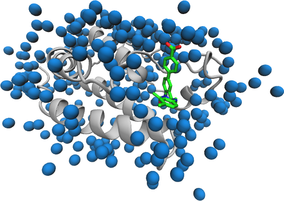

The BAC Builder script requires the input PDB structure to follow a particular format.

1. All chains to be included in the final model must have coordinates present (BIOMT records, etc. will not be applied)
2. The sequence must contain unambiguous coordinates for each residue and atom (i.e. no alternative locations or residues)
3. All hydrogen atoms should be removed
3. Chains must contain no gaps and residues numbered sequentially
4. Each chain must have a unique ID and end with a TER card
5. Chains must be present in a particular order: protein, ligand, solvent.
6. All residues included must be compatible with the Amber forcefield. In the case of the ligand, this means that the included version of the coordinates should be those generated during parameterization (to ensure atom names are consistent).

In addition any ligands will need to be parameterized before they can be simulated.
In this section we will prepare the protein and solvent elements of the PDB for incorporation in the starting model and the ligans for parameterization.

Models for preparation in BAC can come from many sources but a common scenario is that the starting point is a PDB containing coordinates for all components of the system.
In this section we detail the steps necessary to create a BAC input PDB from such a model.
The PDB [4BJX](examples/4bjx.pdb) is used as an example to illustrate the general process (it can be downloaded from the link for use when following along).

In this example we assume that you begin with a PDB containing all elements of the system.
Where multiple ligands are to be added to the same protein receptor then once the protein structure has been prepares once you can skip to the [ligand preparation](#prepare-ligand) section to create input for parameterization.

## Protein model

The example structure contains a protein, ligand and solvent molecules (see picture below).
The first step is to separate the protein chains and ensure they are ready for incorporation in the final model.



Before proceeding the protein should be checked to ensure that no residues are missing from the chains.
If using a file directly from the Protein Databank then the header provides information on missing residues.
If not you will have to check manually (using a program such as  [VMD](http://www.ks.uiuc.edu/Research/vmd/)).

The protein model must be extracted from the PDB.
Simple ways of achieving this in general include the use of protein selections within viewers like VMD or using a text editor.
In the case of the 4BJX the protein residues are the only ones provided as `ATOM` records meaning that a `grep` command (in Linux) can be used to obtain the protein residues alone in a separated PDB:

```
grep ^ATOM 4bjx.pdb > 4bjx-protein.pdb
```

To remove alternative conformers for residues and get a report on any non-standard residues use `pdb4amber`, part of the AmberTools package:

```
pdb4amber -i 4bjx-protein.pdb -o 4bjx-protein-stripped.pdb --nohyd
```

This will save the updated coordinates in `4bjx-protein-stripped.pdb` and provide a short report to the console about the residues edited. The `--nohyd` flag removes hydrogens, you can leave this off if you are confident that the atoms present are correctly names for use in Amber.

THE `END` line at the end of the file should be replaced with `TER` (using either a text editor or `sed`).
For proteins containing multiple chains `TER` lines should be inserted between each pair .

### Non-standard residues

Non-standard residues (such as those incorporating post-translation modifications) cannot usually be incorporated in BAC models.
However, if you have Amber `frcmod` and `lib` files these can be incorporated in the system description.

### Biological units

No transforms are applied by BAC Builder so these need to be accounted for before processing of the PDB begins.

### Disulphide bonds

A file, with the suffix '\_sslinks', detailing the bonds to be made should be provided by `pdb4amber`.
Retain this file as it will be included in the final system description.

## Solvent molecules

Any solvent molecules you wish to be retained in the final model must be extracted from the PDB.
Again, this can be done using a variety of methods (VMD, text editor, etc.).
BAC Builder can only parse a small number of solvent atoms

| Solvent molecule    | Residue Name |
|---------------------|--------------|
|Water                |     HOH      |
|Magnesium            |     MG       |
|Zinc                 |     ZN       |
|Chlorine             |     CL       |
|Sodium               |     NA       |

The solvent can be extracted from 4BJX using:
```
grep " HOH | MG | ZN | CL | NA " 4bjx.pdb > 4bjx-solvent.pdb
```

Note: This `grep` command can be dangerous if the ligand contains 'CL' atoms and entries in the element column.

## Prepare ligand for processing

In order to parameterize the ligand we need to have a separate PDB containing only ligand atoms.
Create this PDB using the same tools as for the protein and solvent atoms.

The ligand can be extracted from 4BJX using:
```
grep "73B" 4bjx.pdb | grep HETATM > 4bjx-ligand.pdb
```

In the next section we will see how to create a parameterization for the ligand.
